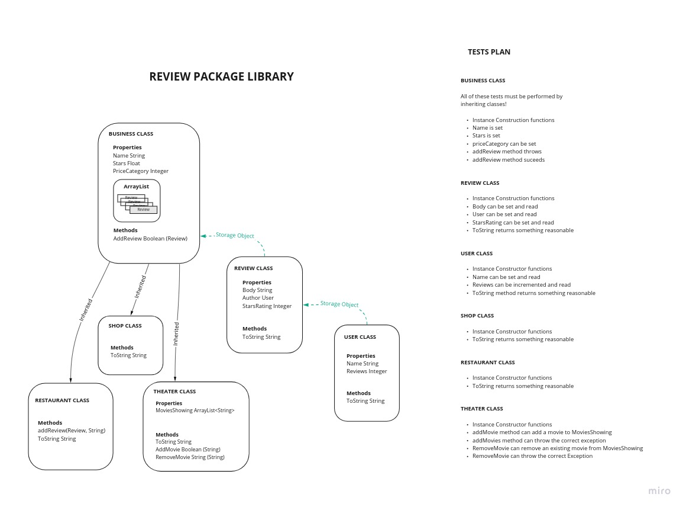

# Java Fundamentals: Inheritance Lab

## Purpose and Overview

## Feature Tasks and Status - Tuesday

[X] Start with Monday's Feature Tasks and Status.  
[X] Create a SHOPS Class with name, description, and dollar-sign rating.  
[X] Update the REVIEW Class to allow reviewing Shops like Restaurants.  
[X] Create a THEATER Class so users can review Theaters and the movies they are showing.  
[X] Implement addMovie() and removeMovie() methods in the THEATER Class.  
[X] Refactor REVIEW Class to review Shops, Theaters, and Restaurants.  
[X] Implement a method that reviewers can use to add the Name of the Movie along with their review, OR NOT.  
[X] Implement Constructors, reasonable toString() methods, and basic tests for all of the above Classes.  

### Stretch Goals

[ ] Add an updateStars() method in the REVIEW Class to update stars for a specified review.  
[ ] Ensure an updated Review is associated with all reviewable Classed things.  
[ ] Refactor your code to make star tracking an instance METHOD instead of a PROPERTY.  
[partial] Create a USER Class so it can be tracked which reviews were written by the same user.  
[ ] Ensure a single user instance cannot submit multiple reviews for the same reviewable thing.  

### Gradle Build and Test Status

```shell
λ  java-fundamentals/inheritance comp-inheritance-two ✗ gradle build

BUILD SUCCESSFUL in 591ms
4 actionable tasks: 2 executed, 2 up-to-date
λ  java-fundamentals/inheritance comp-inheritance-two ✗ ./gradlew test

BUILD SUCCESSFUL in 379ms
3 actionable tasks: 3 up-to-date
λ  java-fundamentals/inheritance comp-inheritance-two ✗ 
```

In Summary:

> gradle build => PASS!

> ./gradlew test => PASS!  

#### Test Details

See the Documentation Updates and Library Architecture for details list of tests.  

*Note*: Only the most critical tests were actually build and are passing.  

Existing tests are high-code-coverage tests.  

See [The Test File](/lib/src/test/java/inheritance/LibraryTest.java) for details.  

### Documentation Updates

See [Library Architecture](#Library-Architecture) later in this doc for the latest design documentation.  

## Feature Tasks and Status - Monday

### Restaurant Class

[X] Create a Restaurant Class with constructor and props 'name', 'stars', and 'cost', and a toString method.    
[X] Create unittests to verify constructor is behaving correctly.  
[X] Create unittests to verify toString override method is working as expected.  

### Review Class

[X] Create a Review CLass with a constructor and props 'body', 'author', and 'stars', and a toString method.  
[X] Create unittests to verify constructor is working properly.  
[X] Create unittests to verify toString override method is working as expected.  

### Interaction and Refactoring

[X] A Review should be about a single Restaurant => Implement a solution for this based on the following questions:  

> Should a Review know which Restaurant it is about? Yes
> Should a Restaurant know which Reviews are about it? Yes they should be related

> Is a Restaurant a special type of Review? Vice Versa? No, neither

[X] Update toString and constructor methods appropriately.  
[X] Update unittests to reflect the refactorings completed above.  

### Instance Methods

[X] Add an instance method 'addReview' to the Restaurant class, that takes in a Review type parameter and adds it to the Restaurant instance.  
[X] Add unittests to ensure the method addReview works by creating an association between Restaurant and Review.  

### Associating Reviews

[X] A Restaurant's star rating should change when a review is associated with a Restaurant, via the addReview method.  
[X] Add unittests to verify proper functionality

### Stretch Goals

[ ] Some Restaurants are part of a chain. Implement a means to associate all chain restaurants e.g. McDonald's, and add unittests to verify functionality.  
[ ] Add an updateStars method to the Review class to update stars *for that review* and, if the Review is associated with a Restaurant the stars for *that restaurant* are updated.
[K] Refactor your code and get rid of that instance variable for stars and instead make it an instance *method* that calculates a restaurant star rating on the fly when called.  
[ ] Create another class for User, as in Author of a Review, and limit each User to a single review per Restaurant.  

## Library Architecture

This is a very simple Java Library with 2 Classes: Restaurant; Review.  

  

Restaurant Class is:

- A concrete Class with various members
- A constructor with parameters for initializing an object instance
- Properties name, stars, and priceCategory
- An instance method to add a Review

Review Class is:

- A concrete Class with various members
- A constructor with parameters for initializing an object instance
- Properties for body (review text), author (review Author), and starRating (Ratings Stars of the review)

Both Classes have overridden toString() methods that will return informative state text to the calling method.  

When a Restaurant instance is added, ensure a Name and Price Category is included in the constructor.  
When creating Reviews, ensure the Author Name, Review Body, and Stars Rating (whole number) are included.  

When a Review is added to a Restaurant, the Star Rating will update automatically.

## Build and Test

Install Gradle for your platform.  
Run `./gradlew test` from the Terminal to test the Package from the Package Root directory.  

## Footer

TBD

